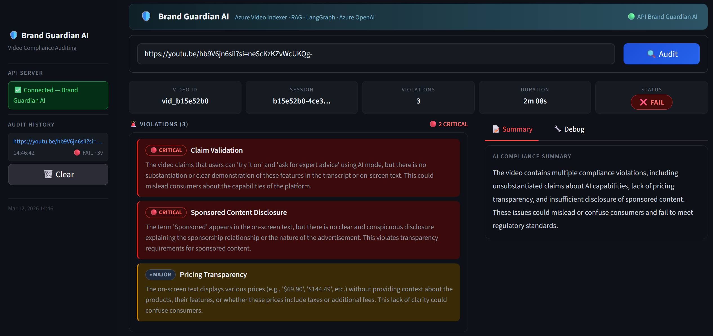
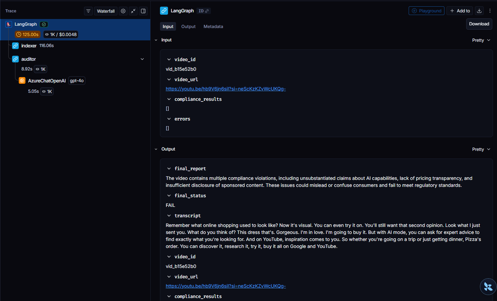
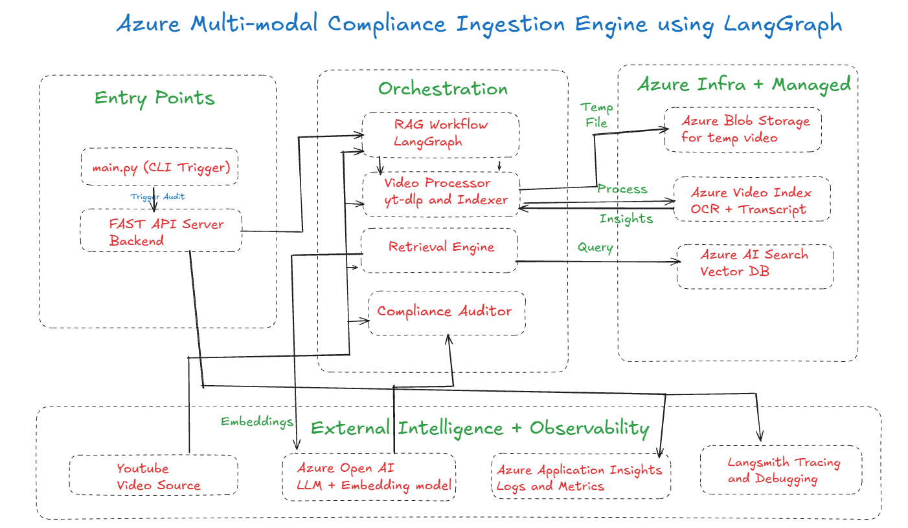

<div align="center">

# 🛡️ Azure Multi-Modal Compliance Orchestration Engine  
## using LangGraph, LangSmith, Azure Video Indexer, RAG, and Azure OpenAI

<p align="center">
  A production-grade agentic AI system that audits video advertisements against regulatory and platform compliance rules using multimodal ingestion, retrieval-augmented reasoning, and full-stack observability.
</p>

<p align="center">
  
  
  
  
  
  
  
  
</p>

</div>

---

## Overview

This project builds an automated **Video Compliance QA Pipeline** orchestrated by LangGraph to audit advertisements against regulatory and platform-specific standards. It uses **Azure Video Indexer** for multimodal ingestion, **Azure AI Search** for retrieval over compliance documents, and **Azure OpenAI** for grounded reasoning to generate structured JSON audit reports.

The system is designed as a **production-style backend-first architecture** with:
- **FastAPI** as the primary interface,
- **Streamlit** as a visual dashboard,
- **LangSmith** for deep LLM workflow tracing,
- and **Azure Application Insights** for telemetry, latency tracking, and failure diagnostics.

The exported Swagger UI confirms the FastAPI application exposes `POST /audit` and `GET /health`, and that the audit response includes fields such as `session_id`, `video_id`, `status`, `final_report`, and `compliance_results`.

---

## Hero Preview

### Streamlit Dashboard

<p align="center">
  
</p>

The Streamlit dashboard presents audit results in a compact executive-style layout with video metadata, overall status, violation cards, and an AI-generated compliance summary.

### LangGraph + LangSmith Trace

<p align="center">
  
</p>

LangSmith tracing captures the orchestration path, node execution timing, LLM invocation details, and workflow state transitions, enabling transparent debugging and optimization of the agentic pipeline.

---

## Problem Statement

Video ads often contain subtle compliance issues such as:
- misleading product claims,
- insufficient sponsorship disclosure,
- pricing ambiguity,
- trademark misuse,
- or platform policy violations.

Manual review is slow, expensive, and difficult to scale. This system automates that review process by converting video into machine-readable signals, retrieving the relevant compliance rules, and generating a grounded pass/fail audit with structured findings.

---

## Guiding Documents

The knowledge base for compliance reasoning is built from two policy documents:

- **Disclosures 101 for Social Media Influencers**
- **YouTube Ad Specs in 2025**

These documents are chunked, embedded, and stored in **Azure AI Search**, enabling retrieval of the most relevant rules for a specific video during audit time.

---

## Architecture

### High-Level System Design

<p align="center">
  
</p>

The architecture diagram illustrates a layered production design connecting:
- **entry points** (`main.py`, FastAPI, Streamlit),
- **LangGraph orchestration**,
- **video processing and indexing**,
- **retrieval and reasoning**,
- **Azure managed services**,
- and **observability systems**.

### Architecture Flow

```text
Entry Points
 ├── main.py (CLI trigger)
 ├── FastAPI backend
 └── Streamlit UI
         │
         ▼
LangGraph orchestration
 ├── Video Processor
 │   ├── yt-dlp download
 │   ├── Azure Blob upload
 │   └── Azure Video Indexer
 │       ├── Transcript
 │       └── OCR
 │
 ├── Retrieval Engine
 │   ├── Azure OpenAI embeddings
 │   └── Azure AI Search
 │
 └── Compliance Auditor
     └── Azure OpenAI reasoning
         │
         ▼
Structured JSON Compliance Report
         │
         ▼
Observability
 ├── LangSmith tracing
 └── Azure Application Insights telemetry
```

---

## End-to-End Workflow

### 1. Video Submission
A YouTube advertisement URL is submitted through FastAPI or Streamlit.

### 2. Video Ingestion
The system downloads the video using `yt-dlp` and stages it in **Azure Blob Storage**.

### 3. Multimodal Indexing
**Azure Video Indexer** processes the video and extracts:
- spoken transcript,
- OCR text from on-screen visuals,
- metadata required for downstream reasoning.

### 4. Retrieval-Augmented Generation
The transcript and OCR text are combined into a query and matched against vectorized policy documents stored in **Azure AI Search**.

### 5. Compliance Reasoning
**Azure OpenAI** compares:
- the content of the video,
- the on-screen text,
- the spoken script,
- and the retrieved rules

to identify violations and generate a structured report.

### 6. Structured Report Generation
The system returns:
- audit status (`PASS` / `FAIL`),
- compliance findings,
- severity levels,
- and an AI-generated summary.

### 7. Observability
The audit flow is monitored using:
- **LangSmith** for tracing LLM workflow execution,
- **Azure Application Insights** for logs, latency, metrics, and failures.

---

## Core Technologies

### Agentic AI Orchestration
- **LangGraph**
- **LangSmith**

### Azure AI Stack
- **Azure OpenAI**
- **Azure AI Search**
- **Azure Video Indexer**
- **Azure Blob Storage**
- **Azure Application Insights**

### Backend and UI
- **FastAPI**
- **Streamlit**
- **Pydantic**
- **Uvicorn**

### Supporting Tools
- **yt-dlp**
- **Python**
- **uv**
- **requests**
- **python-dotenv**

---

## Azure Services Used

### Azure Blob Storage
Used for temporary video staging before indexing.

### Azure Video Indexer
Performs multimodal video understanding and returns transcript + OCR for the ad content.

### Azure OpenAI
Provides:
- the **reasoning model** for compliance analysis,
- the **embedding model** for document retrieval.

### Azure AI Search
Stores embedded chunks of the compliance documents and supports vector / hybrid search during audit-time retrieval.

### Azure Application Insights
Provides production telemetry including:
- request tracing,
- latency monitoring,
- error tracking,
- and live diagnostics.

---

## LangGraph Workflow Design

The orchestration logic is built as a directed state graph:

```text
START → Indexer → Auditor → END
```

### Indexer Node
Responsible for:
- downloading the YouTube video,
- uploading it to Azure Blob Storage,
- submitting it to Azure Video Indexer,
- waiting for processing,
- extracting transcript and OCR results.

### Auditor Node
Responsible for:
- retrieving relevant compliance rules from Azure AI Search,
- passing transcript + OCR + retrieved rules to Azure OpenAI,
- generating a structured compliance assessment.

This design keeps ingestion and reasoning separated into explicit workflow nodes, which improves debuggability and observability.

---

## API Design

The FastAPI service acts as the system’s primary production interface.

### Main Endpoints
- `POST /audit`
- `GET /health`

### Request Flow

```text
Client
  │
  ▼
POST /audit
  │
  ▼
FastAPI request validation
  │
  ▼
Generate session + prepare initial state
  │
  ▼
LangGraph invoke()
  │
  ▼
START → Indexer → Auditor → END
  │
  ▼
AuditResponse JSON
  │
  ▼
Client / Streamlit UI
```

The exported Swagger documentation shows that the API accepts a `video_url` request body and returns a structured audit response with a 200 status for successful requests.

### Example Audit Response

```json
{
  "session_id": "35bb0c22-e0bf-4de1-a4e3-67badf85a436",
  "video_id": "vid_35bb0c22",
  "status": "FAIL",
  "final_report": "The video contains a potentially misleading product claim about the sunscreen’s invisibility and improper use of a trademarked slogan associated with John Cena.",
  "compliance_results": [
    {
      "category": "Claim Validation",
      "severity": "CRITICAL",
      "description": "The claim 'Sunscreen you can't see' could be misleading as it implies complete invisibility."
    },
    {
      "category": "Trademark Misuse",
      "severity": "MAJOR",
      "description": "The phrase 'You can't see me' is a trademarked slogan associated with John Cena."
    }
  ]
}
```

---

## Streamlit Result Experience

The dashboard provides a polished visual summary of the backend audit pipeline, including:
- video ID,
- session ID,
- total violations,
- duration,
- PASS / FAIL status,
- categorized violation cards,
- AI-generated compliance summary.

The captured dashboard result demonstrates a failed audit with multiple issues such as claim validation, sponsored content disclosure, and pricing transparency, presented in a compact UI with severity-coded cards.

---

## Observability and Production Monitoring

### LangSmith Tracing
LangSmith provides deep introspection into:
- node execution sequence,
- prompt and response inspection,
- token usage,
- latency per LLM call,
- and state transitions.

The trace screenshot shows the LangGraph execution tree, including the `indexer` and `auditor` steps and the downstream AzureChatOpenAI call timing.

### Azure Application Insights
Azure Monitor integration adds infrastructure-grade observability for:
- API request timing,
- backend failures,
- retries and errors,
- and service health monitoring.

Together, LangSmith and Application Insights create a strong observability story across both **AI reasoning** and **application infrastructure**.

---

## Repository Structure

```text
ComplianceQAPipeline/
│
├── frontend/
    └── streamlit_app.py
├── backend/
│   ├── data/
│   │   ├── 1001a-influencer-guide-508_1.pdf
│   │   └── youtube-ad-specs.pdf
│   │
│   ├── scripts/
│   │   └── index_documents.py
│   │
│   └── src/
│       ├── api/
│       │   ├── server.py
│       │   └── telemetry.py
│       │
│       ├── graph/
│       │   ├── __init__.py
│       │   ├── nodes.py
│       │   ├── state.py
│       │   └── workflow.py
│       │
│       └── services/
│           ├── __init__.py
│           └── video_indexer.py
│
├── main.py
├── Dockerfile
├── pyproject.toml
├── uv.lock
└── README.md
```

---

## Key Modules

### `index_documents.py`
Loads and chunks compliance PDFs, generates embeddings, and uploads vectorized chunks into Azure AI Search.

### `video_indexer.py`
Handles:
- YouTube video download,
- Blob upload,
- Azure Video Indexer submission,
- polling,
- transcript and OCR extraction.

### `nodes.py`
Defines the LangGraph workflow nodes:
- `index_video_node`
- `audio_content_node`

### `workflow.py`
Compiles the LangGraph state machine and exposes the runnable `app`.

### `server.py`
Implements the FastAPI backend and exposes the compliance audit API.

### `telemetry.py`
Configures Azure Application Insights and observability hooks.

### `streamlit_app.py`
Provides a visual interface for running audits and reviewing compliance results.

---

## Production Characteristics

This project demonstrates production-style AI system design through:
- **backend-first architecture**,
- **explicit workflow orchestration**,
- **RAG over legal/policy documents**,
- **multimodal ingestion**,
- **structured JSON outputs**,
- **traceability with LangSmith**,
- **telemetry with Azure Monitor**,
- and **clear separation of orchestration, services, retrieval, and API layers**.

---


